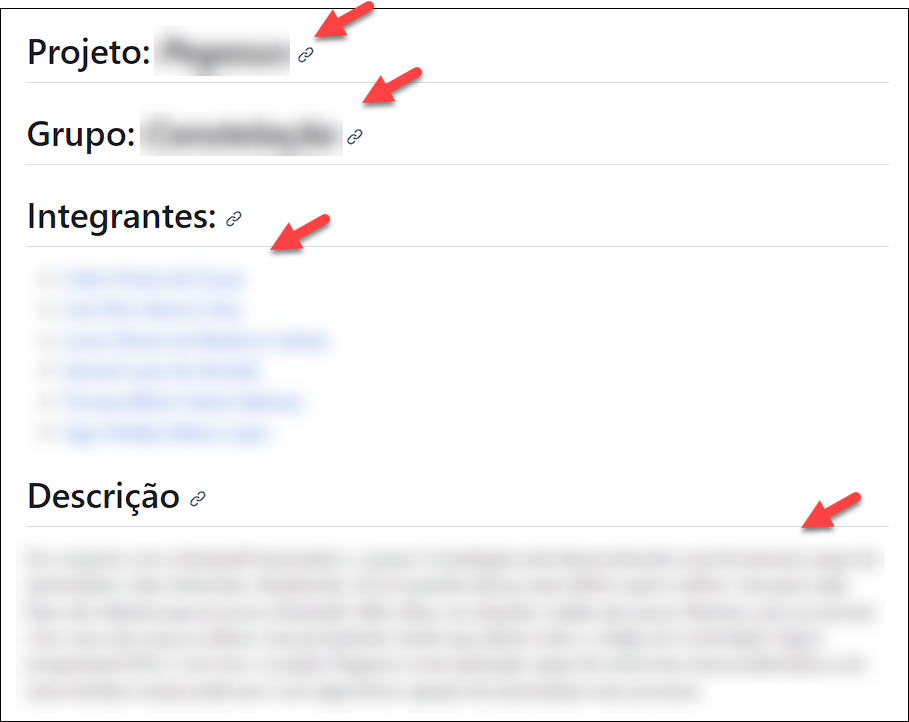
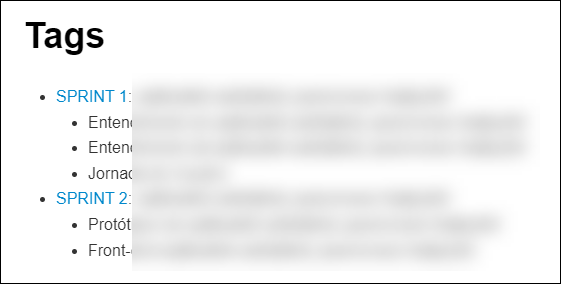

# Checklist para a entrega do projeto 

**Nome do projeto:** Aumento da performance logística na distribuição de minério de ferro

## 1. No arquivo README.md

- [ ] (a) Os logos do parceiro e do Inteli estão no topo da página.

---

- [ ] (b) O texto com as instruções iniciais para os alunos foi removido.

---

- [ ] (c) Os campos projeto, grupo e integrantes estão preenchidos corretamente.
- [ ] (d) O campo descrição contém um resumo do problema e da solução desenvolvida.

---

- [ ] (e) Contém instruções para desenvolvedores utilizarem o código do repositório.

---

- [ ] (f) Menciona explicitamente que a licença do projeto é a "Application 4.0 International".
- [ ] (g) O nome da licença está com link para https://creativecommons.org/licenses/by/4.0/?ref=chooser-v1
- [ ] (h) Apresenta o logo https://creativecommons.org/wp-content/themes/vocabulary-theme/vocabulary/svg/cc/icons/cc-icons.svg#cc-logo
- [ ] (i) Apresenta o logo https://creativecommons.org/wp-content/themes/vocabulary-theme/vocabulary/svg/cc/icons/cc-icons.svg#cc-by

---

- [ ] (j) Há uma lista das tags, com a enumeração dos artefatos de cada tag.

## 2. Organização das pastas e arquivos

- [ ] (a) A raiz do repositório contém apenas as pastas para **artefatos** e **codigo** e os arquivos **README.md**, **.gitignore** e **inteli-logo.png**.

## 3. Na pasta /artefatos

- [ ] (a) Há apenas arquivos no formato markdown (.md) e a pasta de imagens (img).
- [ ] (b) Todos os links dentro dos arquivos no formato markdown (.md) estão funcionando.
- [ ] (c) Todas as imagens estão aparecendo corretamente dentro dos arquivos no formato markdown (.md).

## 4. Na pasta /codigo

- [ ] (a) Há apenas pastas, onde cada pasta corresponde a um item de software do projeto (a figura abaixo mostra um exemplo onde o projeto tem 3 itens de software).

## 5. Ausência de dados sigilosos

- [ ] Nenhum arquivo fornecido pelo parceiro (dados do sistema Norte, dados do sistema Sudeste e Manual do Usuário) está gravado no repositório.
- [ ] Os dados reais utilizados para executar os programas foram apagados ou "anonimizados".
- [ ] Os dados reais mencionados nos documentos (no texto dos arquivos markdown ou nas imagens) foram apagados ou "anonimizados".